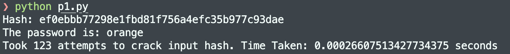
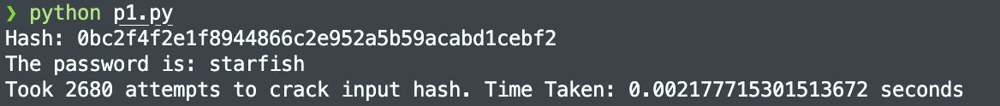
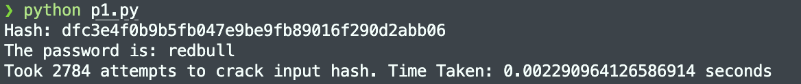
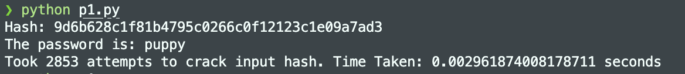
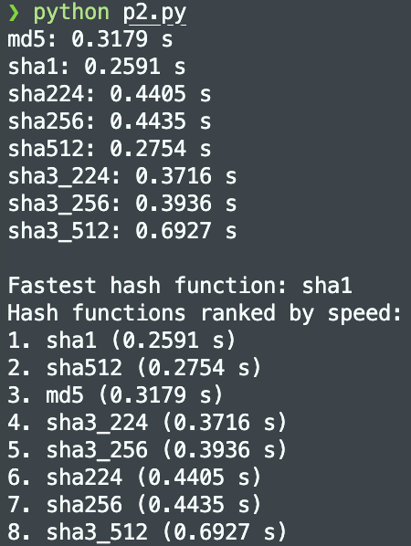
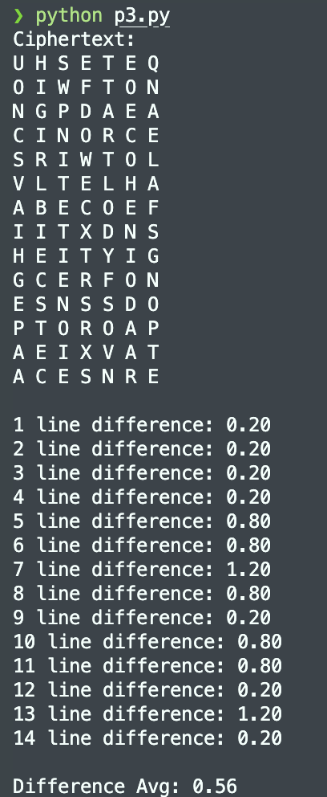
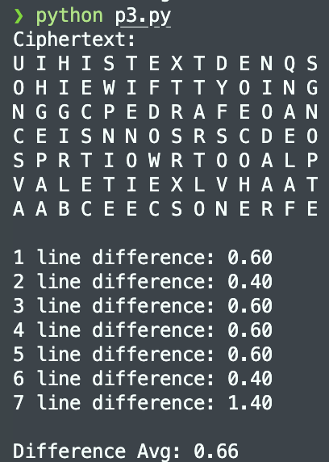
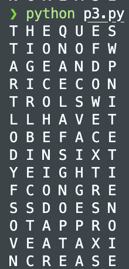

# Quiz 2
## Problem 1
In this problem, I used python package `requests v2.31.0` to fetch txt file of the given link. And I run `conda install requests` to install the package.  Here is the plaintext of each hash:
1. Easy hash:
    ```
    ef0ebbb77298e1fbd81f756a4efc35b977c93dae -> orange
    ```  
    
2. Medium hash:
    ```
    0bc2f4f2e1f8944866c2e952a5b59acabd1cebf2 -> starfish
    ```
    
3. Leet hacker hash:  
    First we decode the hash to **redbull**.
    ```
    dfc3e4f0b9b5fb047e9be9fb89016f290d2abb06 -> redbull
    ```
    
    Then we can use redbull and another word to match the hash.
    ```
    9d6b628c1f81b4795c0266c0f12123c1e09a7ad3 -> rebull + puppy
    ```
    

## Problem 2
  

As the picture shown above, we can know the fastest algorithm is "sha1". And the rank of each algorithm is:
1. SHA1  
2. SHA512  
3. MD5  
4. SHA3-224
5. SHA3-256  
6. SHA224
7. SHA256
8. SHA3-512

## Problem 3
- Avg difference of 14 x 7 rectangle = 0.56:  
    
- Avg difference of 7 x 14 rectangle = 0.66:  
      

So we know 14 x 7 is better size than 7 x 14. Next we can try to shift columns according to ***"the"*** word, then we could guess ***"ques"*** may be the following four character in right position, which is the answer.  
