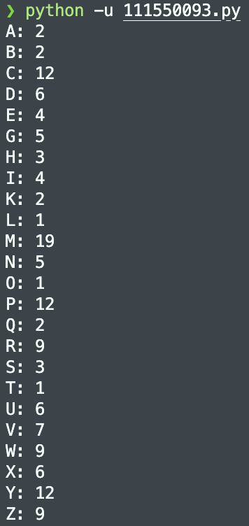

# Quiz 1

## Problem 1
1. See the attached file `111550093.py`.
    
    
2. The plaintext of encrypted message is:
    > *A COMPUTER SCIENTIST MUST OFTEN EXPERIENCE A FEELING OF NOT FAR REMOVED FROM ALARM ON ANALYZING AND EXPLORE THE FLOOD OF ADVANCED KNOWLEDGE WHICH EACH YEAR BRINGS WITH IT* 
    
3. The relation between $C$ and $P$ is shown as the following table:
    | Ciphertext     | A | B | C | D | E | F | G | H | I | J | K | L | M | N | O | P | Q | R | S | T | U | V | W | X | Y | Z |
    |----------------|---|---|---|---|---|---|---|---|---|---|---|---|---|---|---|---|---|---|---|---|---|---|---|---|---|---|
    |                | 0 | 1 | 2 | 3 | 4 | 5 | 6 | 7 | 8 | 9 | 10| 11| 12| 13| 14| 15| 16| 17| 18| 19| 20| 21| 22| 23| 24| 25|
    | **Plaintext**  | U | X | A | D | G | J | M | P | S | V | Y | B | E | H | K | N | V | T | W | Z | C | F | I | L | O | R |
    |                | 20| 23| 0 | 2 | 6 | 9 | 12| 15| 18| 21| 24| 1 | 4 | 7 | 10| 13| 21| 19| 22| 15| 2 | 5 | 8 | 11| 14| 17|  

4. By E, F, G we can infer that $a$ is 3. Then we can easily take 20 into $b$, which is the correct answer. $f(x)=3x+20\mod{26}$. So $a=3, b=20.$
5. The key size of the Mono-Alphabetic Substitution Cipher is $26!$, which is very hard to do exhaustive search.

6. Neither ChatGPT 3 nor 4 can decipher the context, but there is an online tool that can. [Link](https://quipqiup.com/)

## Problem 2
1. To calculate key space of $y=ax+b\mod{30}$, we need to consider the possible values for $a$ and $b$.  
    
    For $a$, since the encryption mapping to be invertible, so there is $\phi{(30)}=8$ possible values.
    
    For $b$, as it is used in modular addition, $b$ can be any integer from 0 to 29.
    
    So the total size of key space is $8\times 30 = 240$
    
2. There are 8 number which are invertible: 1, 7, 11, 13, 17, 19, 23, 29.

    - $1 \times 1\equiv 1 \mod{30}$
    - $7 \times 13\equiv 1 \mod{30}$
    - $11 \times 11\equiv 1 \mod{30}$
    - $13 \times 7\equiv 1 \mod{30}$
    - $17 \times 23\equiv 1 \mod{30}$
    - $19 \times 19\equiv 1 \mod{30}$
    - $23 \times 17\equiv 1 \mod{30}$
    - $29 \times 29\equiv 1 \mod{30}$

3. By running the following program, we can get $k_{enc}=(13,16)$:
    ```python
    datas = [[4, 8], [10, 26], [27, 7]]

    ans_a = 0
    ans_b = 0
    for a in range(30):
        for b in range(30):
            check = 1
            for pair in datas:
                if (pair[1] % 30 != (a * pair[0] + b )% 30):
                    check = 0
                    break
            if(check == 1):
                ans_a = a
                ans_b = b
    print(str(ans_a) + " " + str(ans_b))
    ```
5. Exchange `point[0]` and `point[1]`, we can get $k_{dec}=(7,8)$

